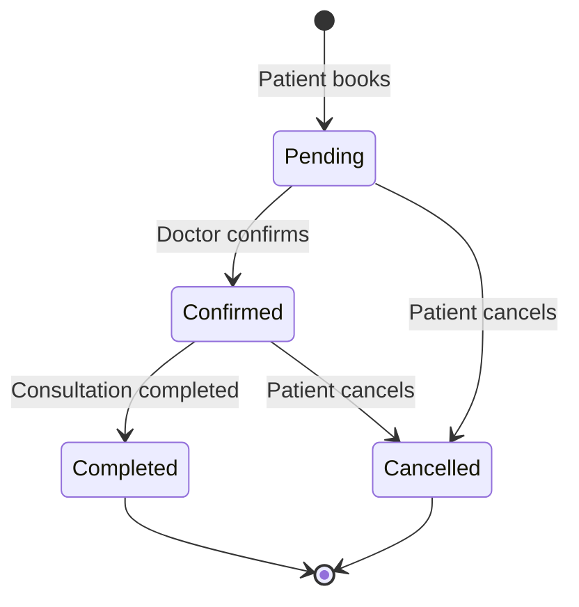

<div align="center">
  

# SmartCare Hub

### A role-based healthcare appointment platform built with PHP, MySQL and JavaScript

**Patient booking · Doctor workflow · Admin operations · Secure authentication · Responsive UI**

</div>

---

## Why this project stands out

SmartCare Hub started as a traditional healthcare appointment CRUD project and was rebuilt into a portfolio-focused product with three connected workspaces, a real appointment lifecycle, responsive dashboards, security hardening, persistent themes, reusable UI behavior and automated repository checks.

The goal is not to imitate a static Dribbble screen. The UI is connected to real MySQL records and the Patient → Doctor → Admin workflow remains functional underneath the redesign.

## Product tour

| Area                     | Highlights                                                                                                         |
| ------------------------ | ------------------------------------------------------------------------------------------------------------------ |
| **Public experience**    | Healthcare SaaS landing page, doctor discovery, responsive navigation, role entry points                           |
| **Patient Portal**       | KPI dashboard, visual booking wizard, doctor cards, live slot availability, lifecycle tracker, appointment archive |
| **Doctor Workspace**     | Pending request queue, confirmation workflow, patient detail modal, completed-visit archive, workload metrics      |
| **Admin Command Center** | Live KPIs, provider approvals, doctor/patient directories, lifecycle analytics, specialty distribution             |
| **Shared experience**    | Light/dark mode, persistent theme preference, toast feedback, responsive design system, reduced-motion support     |

## Appointment lifecycle



Cancelled and completed records remain available as appointment history. Only `pending` and `confirmed` appointments occupy a recurring weekday/time slot.

## Tech stack

- **Backend:** PHP 8.1+, MySQL / MariaDB, `mysqli`
- **Frontend:** HTML5, CSS3, Vanilla JavaScript
- **Security:** `password_hash()`, prepared statements, CSRF tokens, hardened sessions, MIME-validated uploads

- **UI:** Responsive role-based dashboards, persistent dark/light theme, toast notifications and accessible focus/reduced-motion behavior

## Architecture

```mermaid
flowchart LR
    Visitor --> Public[SmartCare Website]
    Public --> Patient[Patient Portal]
    Public --> Doctor[Doctor Workspace]
    Public --> Admin[Admin Command Center]
    Patient --> Lifecycle[Appointment Lifecycle]
    Doctor --> Lifecycle
    Admin --> DB[(MySQL)]
    Lifecycle --> DB
    Patient --> DB
    Doctor --> DB
    Security[Session + CSRF + Password Security] --> Patient
    Security --> Doctor
    Security --> Admin
```



For a deeper technical view, see [`docs/ARCHITECTURE.md`](docs/ARCHITECTURE.md).


## Run it with XAMPP

1. Put the project folder inside `htdocs`.
2. Start **Apache** and **MySQL** from XAMPP.
3. Create/import the database using `database/has.sql` in phpMyAdmin.
4. The default local configuration uses:

```text
host: localhost
port: 3306
database: has
user: root
password: (empty)
```

5. Open `http://localhost/<folder>/` (the root entry point redirects to the SmartCare homepage).

You can override database values using the environment variables shown in `.env.example`.

## Demo accounts

> Demo credentials are for local development only. Change/remove them before deploying publicly.

| Role    | Login        | Password   |
| ------- | ------------ | ---------- |
| Admin   | `admin`      | `admin`    |
| Patient | `9745837908` | `patient`  |
| Doctor  | `9819800000` | `12345678` |

Passwords in the fresh SQL dump are already hashed. Older databases containing plaintext passwords remain compatible: after a successful login, SmartCare automatically upgrades that account to a secure hash.

## Existing database migrations

If you are upgrading an older SmartCare database, **do not overwrite your existing database with `has.sql`**.

Run the migrations in this order:

```text
1. database/migrations/2026_09_19_appointment_lifecycle.sql
2. database/migrations/2026_09_20_security_hardening.sql
```

The lifecycle migration converts the original numeric status values safely. The security migration widens password columns so modern password hashes fit; legacy password values are then upgraded automatically on successful login.

## Security improvements

- Password hashing for all new accounts
- Transparent migration of legacy plaintext passwords
- Prepared statements for authentication, registration, recovery and state-changing user input
- Session ID regeneration after successful authentication
- HTTP-only, SameSite session cookies and automatic Secure cookies over HTTPS
- CSRF protection on state-changing forms
- Role/ownership checks on Patient, Doctor and Admin actions
- 2 MB profile upload limit
- Server-side MIME validation for JPG, PNG and WebP
- Server-controlled upload filenames
- Environment-variable database configuration
- Generic public database errors instead of leaking connection details

See [`SECURITY.md`](SECURITY.md) for the security model and the documented demo-only password recovery limitation.

## Repository structure

```text
smartcare-hub/
├── .github/workflows/       # Automated PHP/JS checks
├── css/                     # Shared + role-specific styling
├── database/
│   ├── has.sql              # Fresh database
│   └── migrations/          # Safe upgrade scripts
├── docs/                    # Architecture documentation
├── img/                     # SmartCare branding/assets
├── js/
│   ├── system.js            # Theme, toast and shared UX layer
│   ├── booking.js           # Multi-step booking experience
│   ├── doctor-workspace.js
│   └── admin-workspace.js
├── php/
│   ├── admin/               # Admin Command Center
│   ├── doctor/              # Doctor Workspace
│   ├── patient/             # Patient Portal
│   ├── appointment_status.php
│   ├── database.php
│   ├── security.php
│   └── index.php
├── SECURITY.md
└── README.md
```

## Portfolio engineering highlights

### 1. Booking is more than a form

The Patient Portal uses a guided specialty → doctor → weekday → time → review workflow. Availability is rechecked server-side before insertion to reduce race-condition double booking.

### 2. One lifecycle, three interfaces

The same appointment status definitions are shared across Patient, Doctor and Admin surfaces instead of each screen inventing its own interpretation.

### 3. Legacy compatibility was preserved

Rather than invalidating old user accounts when password hashing was introduced, login supports a one-time compatibility path that upgrades the password after successful verification.

### 4. Security is visible in the codebase

CSRF, upload validation, session hardening and prepared statements are implemented as real backend behavior—not only listed in the README.

### 5. The repository can validate itself

`.github/workflows/quality.yml` runs PHP syntax checks and JavaScript syntax checks on pushes and pull requests.

## Known architectural limitation

The inherited appointment schema stores the assigned doctor by **doctor name** instead of a doctor ID foreign key. The current application preserves this model to avoid breaking the existing data and workflow. A production-oriented next migration would introduce `doctor_id`, backfill it safely, then add foreign-key constraints.

The appointment model is also **weekday/time based**, not calendar-date based. The UI intentionally does not fabricate real dates that the database does not store.

## Future roadmap

- Calendar-date appointments and doctor availability rules
- Doctor foreign key migration
- Email/SMS password-reset tokens and appointment reminders
- Rate limiting and security audit logs
- Automated integration/browser tests
- REST API/mobile client layer

## Quality checks

Run the same lightweight checks used by CI:

```bash
find php -name '*.php' -print0 | xargs -0 -n1 php -l
find js -name '*.js' -print0 | xargs -0 -n1 node --check
```

---

<div align="center">
  <strong>SmartCare Hub</strong><br>
  Smarter appointment management for patients, doctors and administrators.
</div>
