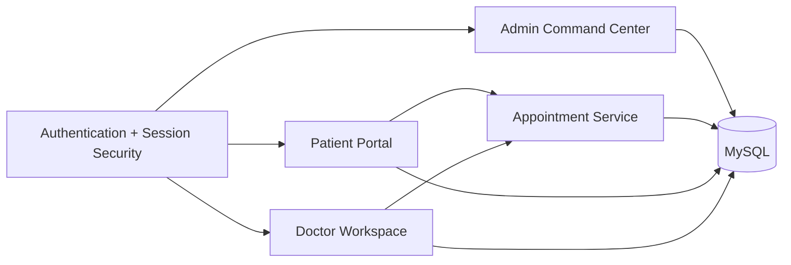
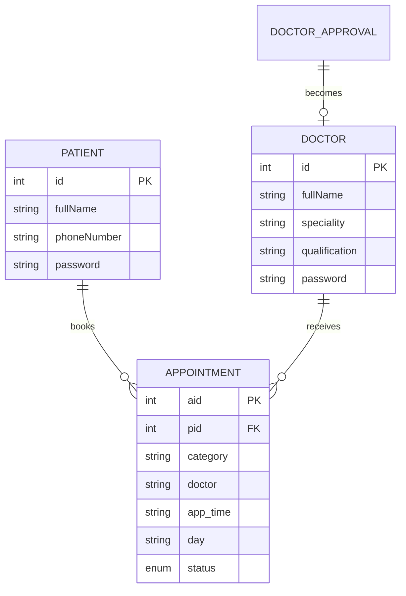

# SmartCare Hub Architecture

SmartCare Hub is a server-rendered PHP/MySQL application with three role-specific workspaces sharing one appointment lifecycle.

## Request flow

1. PHP renders the public site or a role-specific workspace.
2. Authentication uses session cookies configured as HTTP-only and SameSite=Lax.
3. State-changing POST requests include CSRF tokens.
4. MySQL access uses `mysqli`, with prepared statements for user-controlled values.
5. Appointments move through `pending → confirmed → completed`, while cancellation preserves the historical record as `cancelled`.

## Key modules

- `php/security.php` — session, CSRF, password compatibility and common validation helpers.
- `php/appointment_status.php` — shared appointment lifecycle constants/metadata.
- `php/patient/` — booking wizard, patient dashboard and appointment history.
- `php/doctor/` — queue management, confirmation/completion and visit archive.
- `php/admin/` — operational metrics, provider management and approvals.
- `css/system.css` + `js/system.js` — shared design tokens, theme, toasts and micro-interactions.

## Data model

> The legacy schema identifies the assigned doctor by name inside `appointment`. A future production migration should replace that field with a doctor foreign key while preserving historical data.
